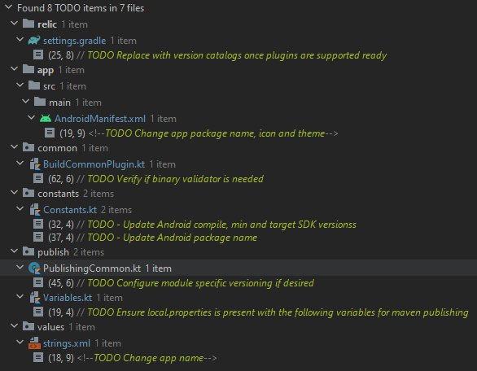

# Android Template

Docs TBA

## Steps

Click `Use this template` to create a new repository with this template.

Open in `Android Studio` and follow the below TODOs to adjust template to your needs

